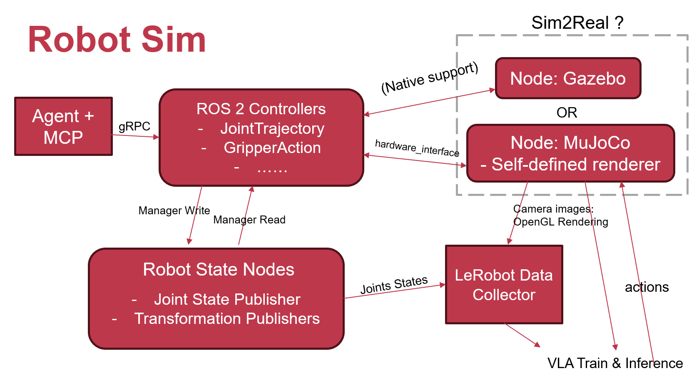

# OH Robot Sim

## 📋 项目简介

Robot Sim 是首个面向 OpenHarmony (EDU) 生态的具身智能机器人模拟器框架，支持自然语言交互、端侧伺服遥控、物理仿真、数据采集及 VLA 模型管理。

核心定位：为 OpenHarmony 开发者提供低成本、高效率的具身智能研发工具，解决现有仿真生态与 OpenHarmony 割裂、端侧协同不足、模型迭代困难等问题。

## ✨ 核心特性

### 1. OpenHarmony 原生适配

*   深度整合 ROS2 Controllers、Robot State Nodes 等核心组件至 OpenHarmony OS

*   支持手机、平板等 OpenHarmony 端侧设备无缝接入仿真系统

*   基于 OpenHarmony 分布式软总线实现跨设备低延迟通信

### 2. 端侧伺服遥控

*   端侧设备化身「伺服遥控器」，通过触摸、姿态等自然交互操纵仿真机器人
*   LeRobot 数据采集，同步获取相机图像、关节状态等多源数据

### 3. 多模态具身任务支持

*   「自然语言 + Agent + MCP」语义解析链路，实现高层指令快速转化

*   兼容 Gazebo/MuJoCo 双仿真引擎，模拟真实物理环境

### 4. 全流程模型支持

*   对接 LeRobot 训练框架，支持 ACT/pi0 等 VLA 模型训练
*   提供模型推理部署接口，快速验证仿真到真实场景迁移效果

## 🏗️ 系统架构

| 层级     | 核心模块                                        | 功能说明                 |
| ------ | ------------------------------------------- | -------------------- |
| 交互层    | ArkTS 前端、端侧伺服遥控、Agent+MCP                   | 多模态指令输入、可视化交互、端侧协同控制 |
| 控制层    | ROS2 Controllers、Robot State Nodes          | 关节轨迹规划、状态采集发布、控制信号生成 |
| 仿真层    | Gazebo/MuJoCo 仿真节点                          | 物理仿真、机器人模型驱动、图像渲染    |
| 数据与模型层 | LeRobot Data Collector、VLA Train\&Inference | 多源数据采集、模型训练、推理部署     |

## 🛠️ 技术栈

| 领域       | 核心技术 / 工具                 |
| ---------- | ------------------------------- |
| 操作系统   | OpenHarmony 5.0.2, Ubuntu 22.04 |
| 机器人控制 | ROS2                            |
| 前端开发   | ArkTS                           |
| 仿真引擎   | Gazebo、MuJoCo                  |
| 模型训练   | PyTorch、LeRobot                |
| 通信协议   | gRPC、ROS2 DDS、HTTP            |

## 📄 许可证

本项目基于 Apache License 2.0 开源，详见 [LICENSE](LICENSE) 文件。

## 📞 联系方式

*   项目维护者：Hongwei Xue (SSRVodka)
*   邮箱：sjtuxhw12345@sjtu.edu.cn

## 🙏 致谢

感谢 OpenHarmony 社区提供的技术支持与生态保障。
